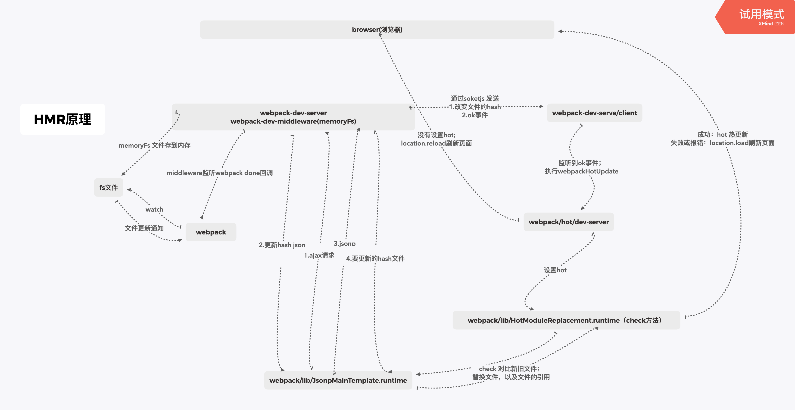

## webpack

### webpack中的hash、chunkhash和contenthash

[webpack中的hash、chunkhash和contenthash](https://blog.csdn.net/major_zhang/article/details/103372987)
[webpack 中，hash、chunkhash、contenthash 的区别是什么？](https://www.1024sou.com/article/289015.html)

### webpack-HRM原理



### Tree-shaking

[Tree-Shaking性能优化实践 - 原理篇](https://juejin.cn/post/6844903544756109319)

[Tree-Shaking性能优化实践 - 实践篇](https://juejin.cn/post/6844903544760336398)

### **webpack优化**

[带你深度解锁Webpack系列(优化篇)](https://juejin.cn/post/6844904093463347208)

- webpack自带**tree shaking**(去除无用代码)
- uglifyjs(代码压缩混淆)/**terser-webpack-plugin**（推荐使用）
多进程压缩 当前 Webpack 默认使用的是 **TerserWebpackPlugin**
- **include exclude** 缩小查找的范围
- alias 别名@
- **extensions** 出现频率较高的文件后缀
- happyPack（已经无人维护） 多进程loader转换**thread-loader**
- **HardSourceWebpackPlugin** HardSourceWebpackPlugin 为模块提供中间缓存，缓存默认的存放路径是: node_modules/.cache/hard-source。
配置 hard-source-webpack-plugin，首次构建时间没有太大变化，但是第二次开始，构建时间大约可以节约 80%。
- 在一些性能开销较大的 loader 之前添加 cache-loader
- dll 抽离第三方模块 我们都不希望这个开发的主力框架每次都被打包一遍，这样也是费时费力的事情; 如react, vue ,等不需要修改的库；add-asset-html-webpack-plugin 在index.html引入dll
- **CDN** 在html文件中引入cdn文件，在webpack配置 externals，这样就不会打包引入的cdn的库;html-webpack-externals-plugin插入CDN文件到index.html

```js
plugins: [
        new HtmlWebpackExternalsPlugin({
          externals: [{
            module: 'vue',
            entry: 'https://lib.baomitu.com/vue/2.6.12/vue.min.js',
            global: 'Vue'
          }]
        })
    ],
```

或者直接配置externals：然后在html中手动添加cdn地址

```js
module.exports = {
    // 其它省略...
    externals: {
        vue: 'Vue'
    },
    // 其它省略...
}
```

- noParse noParse的作用是不去解析你所使用的第三方库中的依赖库
- IgnorePlugin 忽略打包第三方模块指定的目录
- webpack4中自带了抽取公共代码的方法，通过**optimization**里的**splitChunks**来做到 如lodash, vue, vuex, react, react-dom第三方库

开发环境

- **webpack-bundle-analyzer** 明确使用的包
- **speed-measure-webpack-plugin** 分析打包时间
- webpack-dev-server 热更新和代理

### webpack如何分包

- 旧版本
    CommonsChunkPlugin
- webpack4

```js
module.exports = {
    optimization: {
        splitChunks: {
            cacheGroups: {
                utils: {
                    chunks: initial,
                    minSize: 0,
                    minChunks: 2 //两个文件使用
                }
            }
        }
    }
};
```

### 玩转webpackppt

1. [玩转webpackppt 第一章](/interview/玩转webpackppt第一章.pdf)
2. [玩转webpackppt 第二章](/interview/玩转webpackppt第二章.pdf)
3. [玩转webpackppt 第三章](/interview/玩转webpackppt第三章.pdf)
4. [玩转webpackppt 第四章](/interview/玩转webpackppt第四章.pdf)
5. [玩转webpackppt 第五章](/interview/玩转webpackppt第五章.pdf)
6. [玩转webpackppt 第六章](/interview/玩转webpackppt第六章.pdf)
7. [玩转webpackppt 第七章](/interview/玩转webpackppt第七章.pdf)
8. [玩转webpackppt 第八章](/interview/玩转webpackppt第八章.pdf)

## vite

### vite webpack

[Vite和Webpack的核心差异](https://cloud.tencent.com/developer/article/1801741)

Vite 原理 [vite 原理详解](https://blog.csdn.net/huangyilinnuli/article/details/117757135)

vite主要通过 **esbuild预构建依赖**和**让浏览器接管部分打包程序**两种手段解决了这两个问题，下面细讲这两大手段。

### esbuild预构建依赖

vite将代码分为源码和依赖两部分并分别处理，所谓依赖便是应用使用的第三方包，一般存在于node_modules目录中，一个较大项目的依赖及其依赖的依赖，加起来可能达到上千个包，这些代码可能远比我们源码代码量要大，这些依赖通常是不会改变的（除非你要进行本地依赖调试），所以无论是webpack或者vite在启动时都会编译后将其缓存下来。区别的是，vite会使用esbuild进行依赖编译和转换（commonjs包转为esm），而webpack则是使用acorn或者tsc进行编译，而esbuild是使用Go语言写的，其速度比使用js编写的acorn速度要快得多。

esbuild官方做了一个测试，打包生产环境的three.js包十次，上图是各大工具的打包时长。esbuild在打包速度上比现在前端打包工具快10-100倍。

而且vite在打包之后，还会对这些依赖包的请求设置cache-control: max-age=31536000,immutable;,即设置了强缓存，之后针对依赖的请求将不会到达服务器。如果要进行依赖调试，可以在启动服务器时使用 --force 标志

#### 让浏览器接管部分打包

Bundle based dev server在启动时时会把全部的源码都编译，当一个项目有很多路由页面时，它也会按照每一个路由入口查找编译所有模块，但实际上我们是否需要在启动的时候就打包所有的模块源码？

在启动的时候，vite并不会打包源码，而是在浏览器请求路由时才会进行打包，而且也仅仅打包当前路由的源码，这相当于让浏览器掌握了打包的控制权。从而将Bundle based dev server一次性打包全部源码的操作改为了多次，启动速度无疑会快非常多，并且在访问时转换的速度也不会慢下来，因为每次转换的源码只有当前路由下的；并且源码模块还会设置协商缓存，当模块没有改变时，浏览器的请求会返回304 Not Modified。


这一切的前提是基于原生的ES Module,浏览器在处理ES6 Module时，该模块中所有import进来的module都会通过http请求抓取，并且其请求是精确有序的。ESM还对vite的HMR起了非常大的作用。当源码文件修改时，因为源码采取的是ESM,vite只需要精确地使当前修改模块与其最近的HMR边界失效，大多数情况只需要替换当前修改的模块，这让vite的HMR直接与当前应用的大小没有关系。无论应用多大，都能保持快速的更新速度。

### 参考

[vite 原理详解](https://blog.csdn.net/huangyilinnuli/article/details/117757135)
